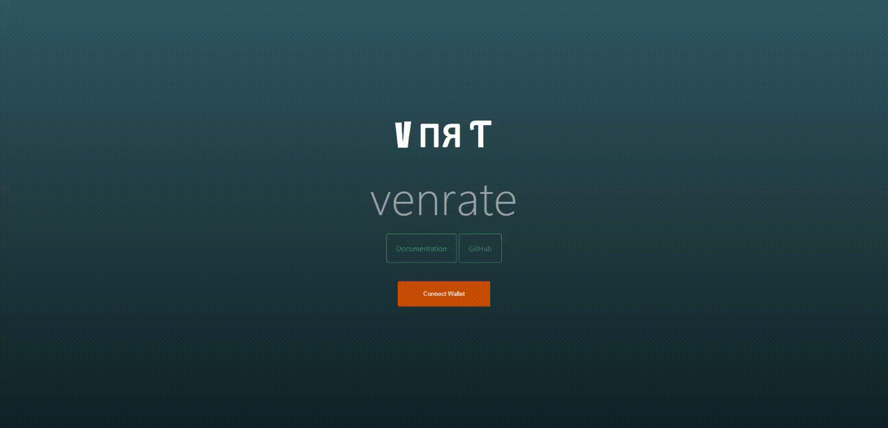
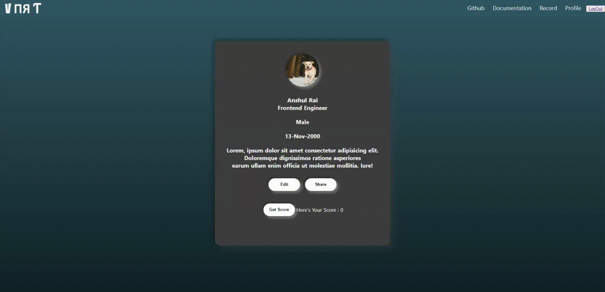

---
# Venrate
---
<strong>Venrate</strong> is a reputation platform which is not tied to any platform and portable across all platforms.
<br/>
There are three components of a reputation based economy: `identity, reputation, and dispute resolution`.
<br/>
Venrate aim to provide a platform that incorporates all components with additional features.

## Tech Stack Used
 - [Ceramic Network](https://ceramic.network)
 - [IDX](https://idx.xyz/)
 - [NUXT (Vue based SSR Framework)](https://nuxtjs.org/)
 - [Vuex](https://vuex.vuejs.org/)
 - [Etherscan](https://etherscan.io/)
 - [IPFS](https://ipfs.io/)
 - Other Authentication framework
---

## How it works
When a user connects his meta mask wallet with venrate ceramic generates a unique did associated with the provided Eth address.<br/>
Now as mentioned earlier the three components of reputation based economy are
-  identity
-  reputation 
-  dispute resolution.
<br/>

### Identity
>A user can update / edit his profile and provide the informations necessary, and also can verify his profile through various other platforms.<br/>
>The idea behind this is to utilise and  absorb different sybil resistant protocols to verify a user instead of creating a new one. <br/>
>This way Venrate is more sybil resistant and able to achieve user identification more easily.

### Reputation
>To calculate the repuatation of an user based on On-chain history, we need to take into account all his transaction history and account balance he has maintained.
>We have to also consider the volume user has transferred in past.<br/>
>Based on this model we can formulate a method to assign a reputation to the user which won't be biased and can't be manipulated. 
<br/>
<strong>Reputation Model</strong>
</img>

### Dispute Resolution
>No platform is perfect in all rights, but we can try to minimise the inability by providing various other methods.
>So if there's any kind of dispute or any user feels that reputation assigned or identity is not valid, he/she can create a record.
>The best part about ceramic is it can sign records / documents and can have history of it. <br/>
>In *`Venrate`* you can create record provided with document proof if there's any dispute.
---

# Use Case
Decentralized finance protocols paired with blockchain-based identity systems are an opportunity to help previously locked-out users access a truly global economic system. DeFi solutions can reduce the collateralization requirements for people who do not have extra funds and help assess users’ creditworthiness via attributes around reputation and financial activity, instead of traditional data points such as home ownership and income. The DeFi space prizes data privacy around personal identifying information, as well as open access. Anyone with an Internet connection can access DeFi applications while maintaining control of their data and assets. 

---

## Project Structure
    .
    ├── .nuxt                   # nuxt config files
    ├── assets                  # Assets ( Image, Logo, etc) 
    ├── components              # Components for pages 
    ├── build                   # Compiled files (alternatively `dist`)
    ├── docs                    # Documentation files (alternatively `doc`)
    ├── public                  # Contains main index.html files
    ├── layout                  # default layout (navbar and footer)
    ├── middleware              # middleware for auth
    ├── plugins                 # custom plugins
    ├── static                  # static pages for pulling static data
    ├── store                   # State management by vuex
    ├── src                     # Source files (alternatively `lib` or `app`)             
    ├── LICENSE
    └── README.md

## Project setup
```
yarn install
```
### Ceramic Client
<!-- tabs:start -->

#### **Ceramic Core**
An API for running the entire Ceramic protocol in a local JavaScript environment, such as directly in-browser
```
Change API_URL variable in "store/index.js" with your own custom ceramic node api or use community API

```

#### **Ceramic Cli**
A command line interface for interacting with a Ceramic node

```
$ ceramic daemon
```
#### **Http-client**
An API for interacting with a remote Ceramic daemon over HTTP
```
Change API_URL variable with your own custom ceramic node api or use community API
```

<!-- tabs:end -->
### IPFS Client
<!-- tabs:start -->

#### **IPFS CLI**
For running IPFS locally
```
$ ipfs daemon
```

#### **IPFS HTTP Client**
An API for interacting with your own custom IPFS node or community node
```
change IPFS_URL variable with your own custom ceramic node api or use community API
```

<!-- tabs:end -->

### Compiles and hot-reloads for development
```
yarn serve
```

### Compiles and minifies for production
```
yarn build
```

### Lints and fixes files
```
yarn lint
```

### Customize configuration
See [Configuration Reference](https://cli.vuejs.org/config/).


# Screens




</img>

